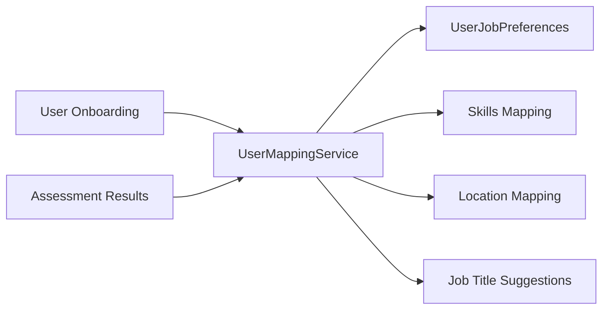
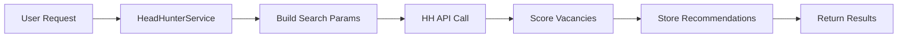

# HeadHunter API Integration & Personalized Job Recommendations

## Overview

This system provides personalized job recommendations by integrating with the HeadHunter (HH) API and analyzing user onboarding data, skills assessments, and feedback patterns.

## System Architecture

### 1. Database Models (`backend/app/models/job.py`)

#### JobRecommendation

-   Stores job recommendations fetched from HH API
-   Includes relevance scoring (skills, location, salary match)
-   Links to user and contains raw HH API response

#### SavedJob

-   Tracks jobs saved by users
-   Application status tracking (saved → applied → interview → hired/rejected)
-   Personal notes and reminders

#### JobFeedback

-   User feedback on job recommendations (relevant/not relevant)
-   Detailed feedback categories (skills, location, salary)
-   Used for improving future recommendations

#### UserJobPreferences

-   Learned preferences from onboarding and feedback
-   Auto-updating based on user interactions
-   Includes positive/negative keyword patterns

### 2. Services

#### HeadHunterService (`backend/app/services/headhunter_service.py`)

**Core functionality:**

-   **API Integration**: Searches HH API with personalized parameters
-   **Scoring Algorithm**: Calculates relevance scores based on:
    -   Skills matching (40% weight)
    -   Location preferences (30% weight)
    -   Salary expectations (30% weight)
-   **Learning System**: Updates user preferences based on feedback
-   **Deduplication**: Prevents duplicate recommendations

**Key methods:**

-   `get_personalized_recommendations()` - Main entry point
-   `_calculate_recommendation_scores()` - Scoring algorithm
-   `update_preferences_from_feedback()` - Learning system

#### UserMappingService (`backend/app/services/user_mapping_service.py`)

**Purpose:** Maps onboarding data to job preferences

**Mapping logic:**

-   **Skills expansion**: General categories → specific technologies
    -   "programming" → ["Python", "Java", "JavaScript", ...]
    -   "design" → ["Photoshop", "Figma", "UI/UX Design", ...]
-   **Location mapping**: City names → HH area IDs
-   **Job title suggestions**: Skills → relevant job titles
-   **Assessment integration**: Strengths/weaknesses → preferred/avoided skills

### 3. API Endpoints (`backend/app/api/jobs.py`)

#### Job Recommendations

```http
GET /api/jobs/recommendations
```

-   Returns personalized job recommendations
-   Auto-refreshes if no recent recommendations (24h)
-   Includes user interaction flags (saved, feedback)

#### Personalized Search

```http
POST /api/jobs/search
```

-   Custom search with override parameters
-   Real-time HH API integration
-   Background preference updates

#### Job Management

```http
POST /api/jobs/save        # Save a job
GET /api/jobs/saved        # Get saved jobs
PUT /api/jobs/saved/{id}   # Update saved job status
```

#### Feedback System

```http
POST /api/jobs/feedback    # Submit job feedback
```

-   Triggers background preference learning
-   Improves future recommendations

#### User Preferences

```http
GET /api/jobs/preferences     # Get current preferences
PUT /api/jobs/preferences     # Update preferences
```

#### Analytics

```http
GET /api/jobs/analytics      # Job search analytics
```

-   Recommendation accuracy
-   Top skills in demand
-   Application success rates

### 4. Integration Points

#### Onboarding Integration

When user completes onboarding (`/api/onboarding/complete`):

1. Extracts skills, location, salary preferences
2. Creates initial `UserJobPreferences`
3. Maps profession to job titles
4. Sets up personalization baseline

#### Assessment Integration

Assessment results automatically enhance preferences:

-   Strengths → preferred skill categories
-   Weaknesses → skills to avoid
-   Combined with onboarding for comprehensive profile

## Data Flow

### 1. Initial Setup



### 2. Job Recommendation Flow



### 3. Learning Flow


## Configuration

### HeadHunter API Settings

```python
# Base URL for Kazakhstan
base_url = "https://api.hh.kz"

# Area mapping (expandable)
area_mapping = {
    "almaty": "160",
    "nur-sultan": "159",
    "astana": "159",
    "shymkent": "161",
    # ... more cities
}

# Employment type mapping
employment_mapping = {
    "full_time": "full",
    "part_time": "part",
    "project": "project"
}
```

### Skill Categories

The system includes predefined skill mappings for:

-   Programming (Python, Java, JavaScript, frameworks)
-   Design (Photoshop, Figma, UI/UX tools)
-   Marketing (SEO, Social Media, Analytics)
-   Data Analysis (Excel, SQL, BI tools)
-   Management (Project management, Leadership)
-   Finance (Accounting, Financial analysis)

## Usage Examples

### 1. Getting Personalized Recommendations

```python
# Automatic recommendations based on user profile
GET /api/jobs/recommendations?page=0&per_page=20&refresh=true

# Response includes:
{
  "recommendations": [...],
  "total": 150,
  "page": 0,
  "per_page": 20,
  "total_pages": 8
}
```

### 2. Custom Search with Overrides

```python
POST /api/jobs/search
{
  "use_preferences": true,
  "override_skills": ["Python", "Django"],
  "override_location": "almaty",
  "override_salary_min": 300000,
  "include_remote": true,
  "page": 0,
  "per_page": 20,
  "exclude_applied": true
}
```

### 3. Saving and Managing Jobs

```python
# Save a job
POST /api/jobs/save
{
  "job_recommendation_id": 123,
  "notes": "Interesting company culture",
  "application_status": "saved",
  "reminder_date": "2024-01-15T10:00:00Z"
}

# Update application status
PUT /api/jobs/saved/456
{
  "application_status": "applied",
  "application_date": "2024-01-10T14:30:00Z"
}
```

### 4. Providing Feedback

```python
POST /api/jobs/feedback
{
  "job_recommendation_id": 123,
  "is_relevant": true,
  "is_interested": true,
  "relevance_score": 4,
  "skill_match_feedback": "good",
  "location_feedback": "good",
  "salary_feedback": "low",
  "feedback_notes": "Perfect role but salary below expectations"
}
```

## Machine Learning & Personalization

### Scoring Algorithm

Each job receives multiple scores:

1. **Skills Match Score** (0.0-1.0)

    - Matches user skills against job requirements
    - Uses keyword matching in job descriptions
    - Weighted by skill importance

2. **Location Match Score** (0.0-1.0)

    - Exact area match = 1.0
    - Remote work preference handling
    - Fallback scoring for neutral preferences

3. **Salary Match Score** (0.0-1.0)

    - Compares job salary with user expectations
    - Handles salary ranges appropriately
    - Accounts for missing salary data

4. **Overall Relevance Score**
    - Weighted combination: 40% skills + 30% location + 30% salary

### Learning System

The system learns from user feedback:

1. **Positive Feedback Processing**

    - Extracts keywords from liked jobs
    - Identifies successful job characteristics
    - Boosts similar recommendations

2. **Negative Feedback Processing**

    - Identifies patterns in rejected jobs
    - Builds avoidance keywords list
    - Reduces similar recommendations

3. **Preference Updates**
    - Automatic updates every 30 days
    - Manual updates via API
    - Maintains feedback history for analysis

## Performance Considerations

### Caching Strategy

-   Recommendations cached for 24 hours
-   Fresh API calls for explicit refresh requests
-   Background preference updates don't block responses

### Rate Limiting

-   HH API calls throttled to prevent limits
-   Batch processing for multiple users
-   Graceful fallbacks for API failures

### Database Optimization

-   Indexed queries on user_id and relevance_score
-   Partitioned by user for large datasets
-   Cleanup jobs for old recommendations

## Error Handling

### HH API Failures

-   Graceful fallbacks to cached recommendations
-   User-friendly error messages
-   Automatic retry with exponential backoff

### Data Quality

-   Validation of HH API responses
-   Handling of incomplete job data
-   Fallback scoring for missing information

## Security & Privacy

### Data Protection

-   User preferences stored securely
-   Job application status private per user
-   Feedback data anonymized for analytics

### API Security

-   Authentication required for all endpoints
-   User data isolation
-   Rate limiting per user

## Future Enhancements

### 1. Advanced ML Features

-   Deep learning for job matching
-   Natural language processing for job descriptions
-   Collaborative filtering based on similar users

### 2. Enhanced Feedback

-   Implicit feedback from user behavior
-   A/B testing for recommendation algorithms
-   Real-time preference adjustments

### 3. Integration Expansions

-   Additional job platforms beyond HH
-   Company culture matching
-   Skill gap analysis and learning recommendations

### 4. Analytics Dashboard

-   Recommendation performance metrics
-   User engagement analytics
-   Market trend analysis

## Testing

### Unit Tests

```python
# Test recommendation scoring
def test_calculate_recommendation_scores():
    # Test with various vacancy and user combinations
    pass

# Test preference mapping
def test_onboarding_to_preferences():
    # Verify skill expansion and mapping
    pass
```

### Integration Tests

```python
# Test full recommendation flow
def test_personalized_recommendations_flow():
    # End-to-end test with real user data
    pass

# Test feedback learning
def test_preference_learning():
    # Verify feedback improves recommendations
    pass
```

## Monitoring & Metrics

### Key Metrics

-   **Recommendation Accuracy**: % of positive feedback
-   **User Engagement**: Click-through rates, saves, applications
-   **API Performance**: Response times, error rates
-   **Learning Effectiveness**: Preference update success rates

### Logging

-   All HH API calls logged with parameters
-   User interactions tracked for analytics
-   Error logging for debugging
-   Performance metrics collection

## Deployment

### Environment Variables

```bash
# HeadHunter API settings
HH_API_BASE_URL=https://api.hh.kz
HH_API_TIMEOUT=30

# Learning system settings
PREFERENCE_UPDATE_INTERVAL_DAYS=30
MAX_RECOMMENDATIONS_PER_USER=1000

# Performance settings
RECOMMENDATION_CACHE_HOURS=24
MAX_CONCURRENT_API_CALLS=10
```

This comprehensive system provides a solid foundation for personalized job recommendations while being scalable and maintainable.
